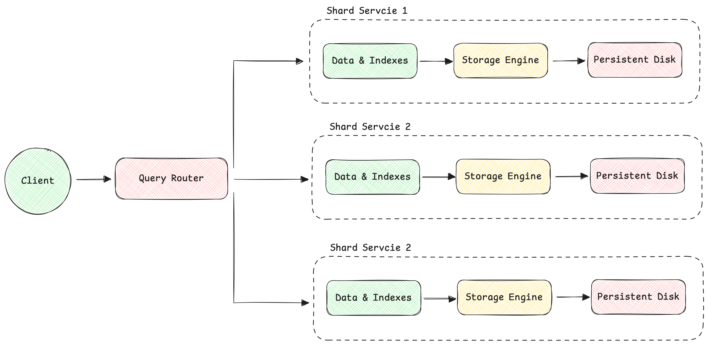

# Distributed Database System concept

This is a conceptual implementation of a distributed database system in Rust, exploring the idea of a scalable and
fault-tolerant data storage solution. The architecture consists of several key components:

*   **Client Service**: Handles SQL queries from users.
*   **Coordinator Service**: Parses SQL queries and determines the necessary operations.
*   **Shard Services**: Stores and manages a portion of the data.
*   **Metadata Service**: Maintains a mapping of data to shards.
*   **Replication Service**: Manages data replication across multiple nodes for redundancy.
*   **Logging and Monitoring Service**: Logs all operations for auditing and debugging purposes.
___

### High Level Architecture


### Low Level Architecture


### Detailed Component Breakdown
1. **Client(s):** Applications or users interacting with the database, sending SQL queries, and receiving results.
2. **Query Router:** The entry point for all client queries. It is responsible for balancing the load, parsing the SQL queries, and routing them to the appropriate shard(s). 
   - **SQL Parsing & Optimization:** Parses SQL queries, checks syntax, and optimizes the query for efficient execution.
   - **Sharding Strategy Module:** Determines which shards are involved in the query based on the query’s content and sharding keys.
3. **Query Execution Plan:** Creates an execution plan for the query, detailing how the query will be executed across the shards.
4. **Shard Dispatcher:** Distributes the query to the relevant shard services based on the execution plan and the target shards identified.
5. **Shard Services:** Independent services that manage specific portions of the database. Each shard service handles a subset of the data.
   - **SQL Engine:** Responsible for executing SQL queries on the shard, managing transactions, and ensuring ACID properties. 
   - **Index Manager:** Manages indexes on the shard, optimizing data retrieval based on indexed columns. 
   - **Storage Engine:** Handles the actual storage and retrieval of data, ensuring durability and consistency.
6. **Persistent Disk:** Physical or cloud-based storage where data, indexes, and logs are persistently stored.
___

### Project Structure
```
/distributed-db-system
├── /config
│   ├── config.yaml                # Configuration file for sharding, replication, etc.
│   └── logger.yaml                # Logger configuration file
├── /src
│   ├── /client
│   │   ├── mod.rs                 # Client interface module
│   │   └── client.rs              # Client implementation
│   ├── /common
│   │   ├── errors.rs              # Common error handling
│   │   ├── mod.rs                 # Common utilities
│   │   └── utils.rs               # Utility functions
│   ├── /config
│   │   ├── config.rs              # Configuration parsing and management
│   │   └── mod.rs                 # Configuration module
│   ├── /query_router
│   │   ├── mod.rs                 # Query router module
│   │   ├── router.rs              # Query routing logic
│   │   └── parser.rs              # SQL parsing and optimization
│   ├── /shard_dispatcher
│   │   ├── mod.rs                 # Shard dispatcher module
│   │   └── dispatcher.rs          # Shard dispatching logic
│   ├── /shard
│   │   ├── /engine
│   │   │   ├── index_manager.rs   # Index management
│   │   │   ├── mod.rs             # Engine module
│   │   │   ├── sql_engine.rs      # SQL engine implementation
│   │   │   └── storage_engine.rs  # Storage engine implementation
│   │   ├── /services
│   │   │   ├── mod.rs             # Shard services module
│   │   │   ├── shard_service.rs   # Individual shard service implementation
│   │   └── mod.rs                 # Shard module
│   ├── /management
│   │   ├── mod.rs                 # Management module
│   │   ├── monitor.rs             # System monitoring
│   │   └── admin.rs               # Administrative functions (resharding, backups, etc.)
│   ├── /models
│   │   ├── mod.rs                 # Models module
│   │   ├── shard.rs               # Shard data structures
│   │   ├── sql_query.rs           # SQL query data structures
│   │   └── transaction.rs         # Transaction data structures
│   ├── main.rs                    # Entry point
│   └── lib.rs                     # Library file
├── /logs                          # Log files
│   ├── system.log
│   └── error.log
├── /scripts
│   ├── build.sh                   # Build script
│   ├── run.sh                     # Run script
│   └── deploy.sh                  # Deployment script
├── /tests
│   ├── /integration
│   │   ├── shard_tests.rs         # Tests for shard services
│   │   ├── router_tests.rs        # Tests for query router
│   │   └── dispatch_tests.rs      # Tests for shard dispatcher
│   └── /unit
│       ├── common_tests.rs        # Unit tests for common utilities
│       └── config_tests.rs        # Unit tests for configuration
├── Cargo.toml                     # Cargo package file
└── README.md                      # Project documentation
```
